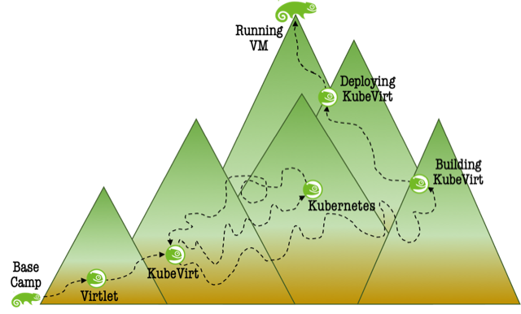

# Introduction: VMs on Kubernetes!

The rapid adoption of Kubernetes in the IT landscape has generated demand for
the ability to run traditional virtualized workloads on Kubernetes clusters,
allowing cluster administrators to manage virtualized and containerized
workloads with the same tooling. There are a few projects projects providing
virtualization support in Kubernetes, with KubeVirt gaining the most traction.

This paper will describe the journey of a few old-school virtualization hackers
as they made their way into the world of containerization, Kubernetes, and
running virtual machines in containers. The journey started with a quick survey
of open source projects providing virtualization support on Kubernetes. After
scouting Camp Virtlet, the explorers traveled to Camp KubeVirt, along with
reconnaissance of Camp Kubernetes. The journey then ventured deeper into KubeVirt
and the process of [painting it green](https://www.youtube.com/watch?v=b0tsZB_LEQk).

[](https://www.youtube.com/watch?v=b0tsZB_LEQk)

The journey continued by exploring the installation of KubeVirt on a Kubernetes
cluster. Once the explorers established high camp with a SUSE green Kubevirt
deployed to the cluster, a final push to the summit was made by creating and
interacting with virtual machines!



Before describing the journey it will be useful to clarify a few terms.

A **pod** is the smallest unit of work that Kubernetes will schedule. It
consists of one or more containers grouped together, as they generally have
to execute closely to realize a particular function or service. These containers
generally share a single network namespace, to be able to communicate simply and
quickly, but have their own PID and mount namespaces, as well as CGroups for
CPU, memory and devices.

A [DaemonSet](https://kubernetes.io/docs/concepts/workloads/controllers/daemonset/)
is a Kubernetes resources that ensures all (or some) nodes run a copy of a pod.
As nodes are added to the cluster, pods are added to them. As nodes are removed
pods belonging to a DaemonSet are garbage collected. Deleting a DaemonSet will
garbage collect related pods.

[Kubelet](https://kubernetes.io/docs/reference/command-line-tools-reference/kubelet/)
is a Kubernetes node agent. Its primary purpose is to take a PodSpec (YAML or
JSON object describing a pod) and ensure the containers described in the
PodSpec are running and healthy.

**virtual machine** refers to a collection of virtual resources that together
present a software-defined machine in which a guest OS can be installed and run.
Likely most readers are familiar with this notion of a virtual machine from
using technologies like KVM, Xen, or VMware.

KubeVirt also uses the term **VirtualMachine** (VM) to refer to a Kubernetes
[Custom Resource](https://kubernetes.io/docs/concepts/extend-kubernetes/api-extension/custom-resources/)
that models a virtual machine and its parameters. This new resource allows users
to define and create VM objects, similar to libvirt
[domXML](https://libvirt.org/formatdomain.html), Xen DomU configuration file, or
a VMWare virtual machine configuration file.

In addition, KubeVirt provides a **VirtualMachineInstance** (VMI) custom
resource for modeling a running VM.


# Base Camp: Planning the Journey

The journey started during Hackweek 19 by scanning the landscape for existing
projects adding Virtual Machine support to Kubernetes. Some projects that
initailly seemed to be related were quickly excluded when it was discovered
they had different goals. For example, the
[Virtual Kubelet](https://github.com/virtual-kubelet/virtual-kubelet) project
provides a kubelet implementation allowing Kubernetes nodes to be backed by
other services such as ACI or AWS Fargate.

The explorers soon decided to focus on two minimally functional open source
projects providing virtual machines support for Kubernetes: Virtlet and KubeVirt.


# Camp I: Virtlet

[Virtlet](https://github.com/Mirantis/virtlet) is a Mirantis sponsored project
that essentially transforms a Kubernetes node from one that runs containers to
one that runs virtual machines. Virtlet enables virtualization in Kubernetes by
replacing the container runtime with one tailored for virtualization.

With this approach any Kubernetes node running Virtlet is in effect restricted
to running virtual machine workloads. Mirantis also provides a CRI proxy that
can forward container runtime RPCs to Virtlet or dockershim, but this approach
excludes support for other CRI-compliant runtimes. The omission of CRI-O is
noteworthy for SUSE since it is the default container runtime in SUSE
Kubernetes products.


Replacing the container runtime, which is at the foundation of the Kubernetes
architecture, seemed a dubious proposition at best. Considering Virtlet is also
quite immature with limited functionality and a stagnant upstream community
(last commit in December 2019, last release in May 2019), the stay at Camp
Virtlet was short-lived.


# Camp II: KubeVirt

The journey's next stop was at [KubeVirt](https://github.com/kubevirt/kubevirt).
KubeVirt is a Red Hat sponsored project that extends Kubernetes by adding
additional virtualization resource types through Kubernetes'
[Custom Resource Definitions (CRD)](https://kubernetes.io/docs/tasks/extend-kubernetes/custom-resources/custom-resource-definitions/)
API. By using this mechanism, the Kubernetes API can be used to manage VM
resources alongside other resources Kubernetes provides. Along with the CRDs,
KubeVirt provides function and business logic for the Kubernetes cluster by
running additional controllers and agents


Although the explorers had little experience with Kubernetes, KubeVirt seemed to
fit more naturally with the Kubernetes, using the mechanisms it provides to
extend the cluster functionality. From here the journey explored KubeVirt in
more depth and even established some new routes by painting KubeVirt green.


# Camp III: Kubernetes Reconnaissance

To better understand KubeVirt, the explorers ventured to Camp Kubernetes to gain
more knowledge about extension mechanisms and deployment patterns.

It was already discovered that KubeVirt extends Kubernetes by adding a CRD and
related logic extensions to the cluster. The CRD essentially registers a new
endpoint with the Kubernetes API server. Requests against this endpoint are
then handled by the logic components, for example virt-api and virt-controller.
The KubeVirt CRD is rather simple, adding the new endpoint `KubeVirt.io` with a
single API version named `v1alpha3`

```yaml
apiVersion: apiextensions.k8s.io/v1beta1
kind: CustomResourceDefinition
metadata:
  labels:
    operator.kubevirt.io: ""
  name: kubevirts.kubevirt.io
spec:
  additionalPrinterColumns:
  - JSONPath: .metadata.creationTimestamp
    name: Age
    type: date
  - JSONPath: .status.phase
    name: Phase
    type: string
  group: kubevirt.io
  names:
    categories:
    - all
    kind: KubeVirt
    plural: kubevirts
    shortNames:
    - kv
    - kvs
    singular: kubevirt
  scope: Namespaced
  version: v1alpha3
  versions:
  - name: v1alpha3
    served: true
    storage: true
```

Once the CRD is registered with Kubernetes, an instance can be created in the
KubeVirt namespace with the following manifest

```yaml
apiVersion: KubeVirt.io/v1alpha3
kind: KubeVirt
metadata:
  name: KubeVirt
  namespace: KubeVirt
spec:
  certificateRotateStrategy: {}
  configuration: {}
  imagePullPolicy: IfNotPresent
```

Custom resources can now be Created, Read, Updated and Deleted (CRUD) using
the endpoint extension in the resource's apiVersion setting. The following
example creates a VirtualMachineInstance custom resource against the
KubeVirt.io entrypoint

```yaml
apiVersion: KubeVirt.io/v1alpha3
kind: VirtualMachineInstance
metadata:
  labels:
    special: vmi-host-disk
  name: sles15sp2
spec:
...
```

Attempting to create a custom resource that is not supported by the KubeVirt.io
endpoint results in an error

```
# cat crap.yaml
apiVersion: KubeVirt.io/v1alpha3
kind: VirtualBoxInstance
...
# k apply -f test.yaml 
error: unable to recognize "test.yaml": no matches for kind "VirtualBoxInstance" in version "KubeVirt.io/v1alpha3"
```

The custom resources supported by KubeVirt are provided by the logic components:
**virt-api**, **virt-controller**, **virt-handler**, and **virt-launcher**. In
addition, **virt-operator** implements a Kubernetes Deployment resource that has
the task of managing the lifecycle of the logic components. Once deployed, the
operator has sufficient knowledge to deploy the other components, extending the
cluster's capabilities with virtualization support.

virt-controller and virt-api are cluster components that handle cluster-wide
requests against the KubeVirt custom resources. virt-handler and virt-launcher
are node components providing logic to create, configure, monitor, and interact
with virtual machines. Adding new custom resources or modifying existing ones
requires changing the cluster-wide components and likely the node components as
well.


# Camp III: Back to KubeVirt

With more knowledge about extending Kubernetes and deploying services to the
cluster, the explorers decided to reacclimate at Camp KubeVirt and start making
plans for painting it green.

KubeVirt is hosted on github and follows a merge request workflow. Pull requests
must be '/approved' by maintainers and all gate tests must pass before the
request is merged. Experience has shown some tests are quite flaky and often
need a '/retest' or two before they pass.

Since KubeVirt is sponsored by Red Hat, it is no surprise that a majority of the
upstream community consists of Red Hat employees. Nonetheless the community is
open and welcoming to newcomers and the primary contributors have been courteous
and helpful. The community uses the
[Virtualization channel](https://kubernetes.slack.com/messages/virtualization)
on Slack for chat and a
[Google groups list](https://groups.google.com/forum/#!forum/KubeVirt-dev)
for more traditional email communications.

Like many projects in the Kubernetes ecosystem, KubeVirt is written in Go. It
uses bazel to build all code and containers. Upstream builds using the standard
make target need network access to download build containers and various bazel
and Go dependencies. Nearly all build targets use a pre-built container called
"builder" that provides the basic build environment.

The builder container can be created from the top level Makefile with the
`builder-build` target, e.g. `make builder-build`. Likewise the builder
container can be published to Docker Hub with the `make builder-publish`
target. When building KubeVirt with the builder container, a persistent
docker volume is created for rsync'ing the KubeVirt sources to the container
and extracting the artifacts after the build. The default make target uses the
builder container to build all the Go components and container images for
running them. Along with the containers, the build also produces manifests for
deploying KubeVirt on a Kubernetes cluster, and a client binary for accessing
the cluster extensions provided by KubeVirt.


# Camp IV: Painting KubeVirt Green

With SUSE's move away from OpenStack and commitment to Kubernetes and
containerization came the need to support virtualized workloads on Kubernetes.
Product management recognized the need and created Engineering Change Orders
(ECO) to provide KubeVirt on SLES. The virtualization team was tasked to
execute. The path became very steep in this part of the journey. At times the
explorers felt as though they were on hands and knees, crawling at a snail's
pace.

The first steps on this path were used to gain a better understanding of the
KubeVirt build system. Currently only Fedora-based builder containers exist
on Docker Hub. Some effort was spent creating an openSUSE
[Leap 15.2 based builder image](https://build.opensuse.org/package/show/home:jfehlig:branches:openSUSE:Templates:Images:15.2/KubeVirt-builder),
which was then successfully used to build KubeVirt, but there has been no
subsequent effort to merge the work upstream.

The downstream part of the path was certainly not downhill. It was this section
of the journey that required the most crawling. The first obstacle was enabling
off-line building required by the build service. Bazel supports an off-line
build mode that uses a previously assembled tarball of all dependencies. The
tarball quickly grew, nearing a whopping 10G, before the explorers decided to
pursue another route. A closer look at the hack/build-go.sh helper script
revealed the KubeVirt binaries could be build directly with

    ./hack/build-go.sh install cmd/$KubeVirt-componenet && ./hack/build-copy-artifacts.sh

This route turned out to be much more promising as it avoided the bazel obstacle
altogether, along with the need for a huge tarball of build dependencies. The
build-go.sh helper uses the familiar `go_build` command to build the components,
which are then copied to a standard location in the build tree for installation.
With this discovery in hand, building the KubeVirt container images in the build
service became a much easier task.

In order to begin fulfilling the productization expectations, packages were
created in the Internal Build Service for virt-api, virt-controller,
virt-handler, virt-launcher, and virt-operator. Initially a release tarball of
the code was copied to each package and a multi-stage docker build was
performed. In the first stage, the related binary was built using build-go.sh
and build-copy-artifacts.sh. The container image was built in the second stage,
which included installing the binary from the first stage. The approach worked
well but duplicate copies of the tarball across several packages was burdensome.

To optimize, a kubevirt package was created where a single copy of the KubeVirt
tarball is used to build intermediate packages used solely for the purpose of
installation during container build. A source service was created to
automatically download new release tarballs and annotate the changelog with
release highlights.

At this point the tired explorers enjoyed a small moment of triumph! All
KubeVirt components were being built against SLE15 SP2 and being installed
when assembling SLE15 SP2 based containers. Alas a green KubeVirt was
available in registry.suse.de for use by other adventurers. For the
virtualization team however, there were still obstacles to overcome.


# Camp V: Deploying KubeVirt

The journey continued with exploring mechanisms to deploy KubeVirt. One obvious
requirement is a working Kubernetes cluster. The SUSE CaaSP product provides a
Kubernetes platform and was used for the exploration of KubeVirt. Adventurers
wanting to explore on their own can refer to a howto on installing
[CaaSP and KubeVirt on a collection of SLES15 SP2 hosts](https://confluence.suse.com/display/virtteam/Installing+KubeVirt+on+CaaSP).

As already mentioned, the KubeVirt operator component implements a Kubernetes
[Deployment resource]( https://kubernetes.io/docs/concepts/workloads/controllers/deployment/)
that manages the lifecycle of the KubeVirt functional components. Deploying the
operator will subsequently deploy KubeVirt, adding virtualization capabilities
to the cluster. The operator is deployed by applying a manifest that describes a
desired cluster state and how to reach that state. The manifest includes the
location and SHAs of the functional KubeVirt components, allowing the operator
to retrieve and deploy the components to achieve the desired cluster state.

When the explorers discovered the manifest must be modified to reference the
SLE-based containers, they took the easy path and manually adjusted the
manifest. A future excursion will investigate mechanisms for substituting the
registry and container SHAs in the manifest as they become known following
container build and publish. Another small adventure is creating a helm chart
for KubeVirt. Kubernetes services are typically managed with a "Kubernetes
package manager" and helm is a widely used one that has also been adopted by
SUSE.

With an updated operator manifest in hand, the operator was deployed to a
CaaSP4.5 cluster running on SLES15 SP2. The explorers could set back, have a
drink, and watch the magic occur as it deployed KubeVirt to the cluster! Their
palettes were barely wet when they noticed the virt-operator container in a
failed state. Much time was wasted digging through logs only to find the
container runtime on the cluster nodes failed to verify the certificate from
registry.suse.de, which prevented pulling the operator image from the registry.
Again the easy route was taken and registry.suse.de was added to the 'registries'
and 'insecure_registries' lists in /etc/crio/crio.conf.d/00-default.conf on each
cluster node. The operator could now be pulled from the registry and work its
magic. Soon the travelers noticed virt-api and virt-controller containers
appearing in the cluster!

Yet again the excitement was short lived, with the virt-controller container
entering a failed state. This obstacle proved quite difficult to overcome and
the explorers seeked aid from the CaaSP team. Not surprisingly, some KubeVirt
components need special privileges to construct a container for running a
virtual machine. The virtual machine container needs access to a container
providing its network endpoints, potentially a container providing storage, etc.
Also not surprising, the default cluster policy does not give containers such
privileges. The CaaSP team helped modify the cluster security policy to give
virt-operator, virt-controller, and virt-handler the necessary privileges.
Typical for the journey, the easy route was taken and the CaaSP privileged
pod security policy was used. A future adventure will explore creating a
proper Pod Security Policy (PSP) for KubeVirt. The PSP could be included as
part of the operator manifest and applied to the cluster when deploying the
operator.

Alas, with the proper security policy in place on the cluster, the operator was
able to successfully deploy KubeVirt! It was time for the travelers to take the
final few steps to reach their goal of running virtual machines on Kubernetes!


# Summit: Running Virtual Machines

Two of the most interesting custom resources provided by KubeVirt have already
been mentioned: VirtualMachine and VirtualMachineInstance. As the name implies,
a VMI is a running instance of a VM. The lifeclycle of a VMI can be managed
independently from a VM, but long-lived, stateful virtual machines are managed
as a VM. The VM is deployed to the cluster in a shutoff state, then activated
by changing the desired state to running. Changing a VM resource state can be
done with the standard Kubernetes client tool `kubectl` or with the KubeVirt
provided client `virtctl`.

The VM and VMI custom resources make up part of the
[KubeVirt API](https://KubeVirt.io/api-reference/master/index.html).
To create a virtual machine, a VM or VMI manifest must be created that adheres
to the API. The API supports setting a wide variety of the common virtual
machine attributes, e.g. model of vCPU, number of vCPUs, amount of memory,
disks, network ports, etc. Below is a simple example of a VMI manifest for a
virtual machine with one Nehalem CPU, 2G of memory, one disk, and one network
interface

```yaml
apiVersion: kubevirt.io/v1alpha3
kind: VirtualMachineInstance
metadata:
  labels:
    special: vmi-host-disk
  name: sles15sp2
spec:
  domain:
    cpu:
      model: Nehalem-IBRS
    devices:
      disks:
      - disk:
          bus: virtio
        name: host-disk
      interfaces:
        - name: green
          masquerade: {}
          ports:
            - port: 80
    machine:
      type: ""
    resources:
      requests:
        memory: 2048M
  terminationGracePeriodSeconds: 0
  networks:
  - name: green
    pod: {}
  volumes:
  - hostDisk:
      path: /hostDisks/sles15sp2/disk.raw
      type: Disk
      shared: true
    name: host-disk
status: {}
```

Applying this VMI manifest to the cluster will create a virt-launcher container
running libvirt and qemu, providing the familiar KVM virtual machine environment
we all know and love

```
kubectl apply -f sles15sp2vmi.yaml
kubectl get vmis
kubectl get pods
```

Similar to other Kubernetes resources, VMs and VMIs can be managed with the
kubectl client tool. Any kubectl operation that works with resource types will
work with the KubeVirt custom resources, e.g. describe, delete, get, log, patch,
etc. VM resources are a bit more awkward to manage with kubectl. Since a VM resource can be in a shutoff state, turning it on requires patching the manifest to change the desired state to running. For example

`kubectl patch vm sles15sp2 --type merge -p '{"spec":{"running":true}}'`

virtctl is a client tool provided by the KubeVirt project that adds syntactic sugar on top of kubectl for VM and VMI resources, allowing them to be stopped, started, paused, unpaused, and migrated. virtctl also provides access to the virtual machine's serial console and graphics server.

```
virtctl start VM
virtctl console VMI
virtctl stop VM
virtctl pause VM|VMI
```

[Disk and storage options](https://kubevirt.io/user-guide/#/creation/disks-and-volumes)
for KubeVirt are quite vast and deserve their own presentation. Nonetheless the
options will be briefly mentioned here. KubeVirt supports the notion of volumes
and disks. Volume resources must be backed by a data source, which is typically
provided by the various storage services available for Kubernetes. Supported
data sources for volume resources include:

cloudInitNoCloud, cloudInitConfigDrive, PersistentVolumeClaim (PVC), dataVolume,
ephemeral, containerDisk, hostDisk, and a few others that are less interesting.

Volume resources are mapped to disks in a VM or VMI manifest, which provide
storage devices for virtual machines. The disk types supported are:

LUN (exposes the volume as a LUN to the VMI)
disk (exposes the volume as an ordinary disk device to the VMI)
CDROM (you get the picture)

The explorers experimented with hostDisk and PVC. hostDisk is quite easy to use.
Simply copy an existing virtual machine image to the same path on each node in
the cluster and reference the path when specifying the hostDisk volume in the
VM or VMI manifest

```yaml
  volumes:
  - hostDisk:
      path: /hostDisks/sles15sp2/disk.raw
```

PVCs are likely the most useful data source for KubeVirt volume resources,
particularly for traditional, stateful virtual machines. As the name suggests,
PersistenVolumeClaims persist across VM restarts. Also as the name suggests,
it is just a claim, a request for storage by the user. The actual storage is
provided by a PersistentVolume (PV), which is a chunk of storage in the cluster
that has been provisioned manually by an administrator, or dynamically using a
Storage Class. An analogy can be drawn between PVCs and pods: pods consume node
resources and PVCs consume PV resources.

The explorers have much to investigate on the topic of storage and KubeVirt.
One final storage-related item worth mentioning is the use of some volume types
is controlled by a feature gate. For example, in order to use hostDisk the
HostDisk
feature gate must be enabled. It is not enabled by default since managing
hostDisks would be cumbersome in production, although as mentioned previously
they are convenient for development.

Enabling KubeVirt feature gates can be done by editing or creating a
KubeVirt-config configmap resource specifying HostDisk in the list of
feature-gates. For example

`kubectl create configmap KubeVirt-config -n KubeVirt --from-literal feature-gates=HostDisk`


# Investigating Obstacles

Those with exploration experience know that problems always arise on such
journeys, and having tools to solve those problems are paramount for success.
When problems arise in Kubernetes, there are many places to look for clues.
Along with the usual system logs from cluster nodes, there are logs from the
kubelet service running on each node, manifests and state information of
cluster resources, logs from cluster pods hosting the resources, and internal
pod inspection to name a few. Throughout this journey the most useful sources
of information were

resource manifests:
`kubectl get resource resource-name -o yaml`

resource current state:
`kubectl describe resource resource-name`

logs from the pod hosting the resource:
`kubectl logs resource-pod-name`

Inspecting the internal state of a pod was also quite useful at times and can
be done by accessing a shell inside the pod:
`kubectl exec -it pod-name -- /bin/bash`


# Journey Summary

With SUSE's commitment to containerization and the rapid adoption of Kubernetes
throughout the IT industry it is desirable to run traditional virtualized
workloads on Kubernetes clusters. Users reap the benefit of using the same
platform and tools to run their containerized and virtualized workloads.

During this journey it was discovered that KubeVirt extends a Kubernetes cluster
capabilities with virtualization using standard Kubernetes APIs, allowing
virtualized workloads to run alongside containerized ones using the same tools.
KubeVirt enjoys a robust upstream community that is currently discussing the
requirements to achieve a "1.0" release. Although not quite as mature as
traditional virtualization management tools like libvirt, KubeVirt is rapidly
evolving and is worthy of more exploration and commitment from SUSE.
